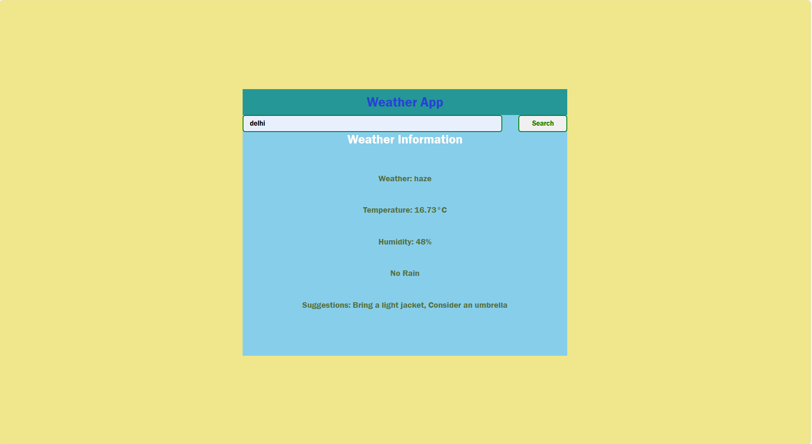

# Weather Application

1. A basic weather application.
1. It shows real time weather of any location.
1. Made with HTML CSS AND Javascript.
1. Responsive to different screen sizes using media queries.

## Features 🚀

1. Easy to Use.
1. User Friendly.
1. Shows current temperature and weather condition.
1. Works offline as well.
1. Can be used on mobile devices.

## How to Use 🤔

1. Download or clone this repository onto your local machine.
1. Open `index.html` file located at the `./index.html` using a web browser.
1. Enter the location in the search box and click search button.
1. If the location is correct then you will get the details for the weather.

## Preview This Project

